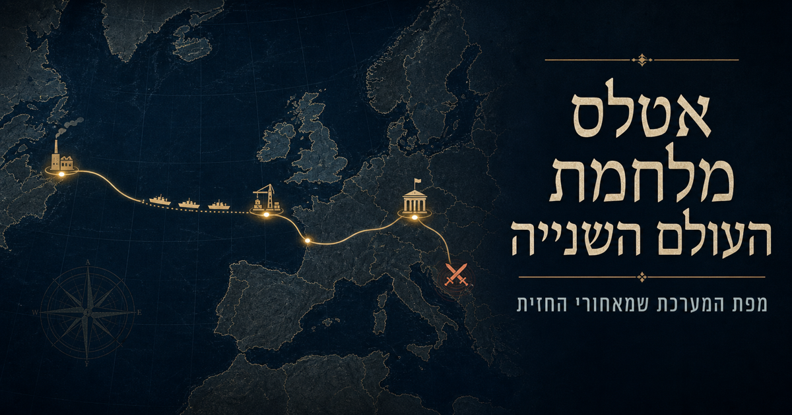
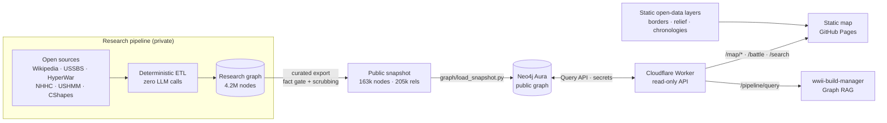

<div align="center">

# WWII Atlas

**An interactive Hebrew atlas of the Second World War: borders, battles, supply lines, naval losses, industry and the
camps, day by day from 1939 to 1945. It is backed by a curated public knowledge graph of 163k nodes and served
through a hardened read-only API.**


[](https://github.com/pinchasrosenberg/wwii-atlas/actions/workflows/ci.yml)




**[▶ Open the atlas](https://pinchasrosenberg.github.io/wwii-atlas/)**

</div>

---

## What it is

A time-scrubbable world map where every layer shares one clock. Drag the timeline from September 1939 to September
1945 and you see:

* historical borders that change on the dates they changed, from CShapes 2.0;
* about **2,500 battles**, each with its facts, casualty figures, units and commanders;
* convoy corridors, the mid-Atlantic air gap and **22,000 naval losses**;
* **7,700 industrial plants** and 13,000 bombing raids aggregated into targets;
* camps and ghettos, with deportations and demographic data where it can be verified;
* rails, fronts, humanitarian aid, famine and displaced persons for stages 3–8.

Every entity says where it came from and whether it is sourced, derived or a reconstruction. The map never
presents an inference as a fact.

## Architecture



**The trust boundary is the API.** The browser never holds credentials and never talks to a database. The map's
Content-Security-Policy allows exactly one remote origin (the API), and only in `connect-src`. If the API is down,
the map still boots on its static layers. The graph itself contains only curated, publishable records (see
[`graph/README.md`](graph/README.md)).

## Repository layout

| Path | What it is |
|---|---|
| [`map/`](map/) | The atlas: MapLibre + deck.gl, a no-build ES-module app, a time engine, a layer registry, performance tiers, deep links and RTL labels. 70+ tests. |
| [`api/`](api/) | Cloudflare Worker. Fixed parameterised Cypher, an owner-only read console, rate limits, edge caching and a keep-alive cron. |
| [`graph/`](graph/) | The public graph: schema, selection policy, and a safety-railed loader for a fresh Neo4j. |
| [`etl/`](etl/) | Deterministic Python ETL for the static open-data layers: CShapes, USHMM, LOC catalog, normalisation, quality scoring, exports. |

## Highlights

* **Engine and content are separate.** `map/src/core` knows nothing about WWII. Swap `config.js` and `layers/` and
  you get a different atlas on the same engine (the companion [roman-atlas-route](https://github.com/pinchasrosenberg/roman-atlas-route)
  explores the same idea).
* **Time as an integer.** Days since the epoch, so it can go straight into GPU shaders. The timeline slows down
  automatically inside high-resolution windows (Poland 1939, Barbarossa, Normandy, the Bulge, …) and shows an
  activity histogram.
* **Performance tiers** from real GPU detection and live FPS, with recovery from WebGL context loss and lazily
  loaded terrain tiles.
* **Hebrew labels that actually render.** deck.gl's `TextLayer` can't draw Hebrew, so labels are placed on a 2D
  canvas with collision-aware layout, much like a paper atlas.
* **Safe by construction.** No `innerHTML` anywhere (enforced by a test), self-hosted dependencies, a strict CSP and
  no secrets in client code (all enforced by tests).

## Run locally

```bash
cd map
npm test                      # 70+ tests, no network
python3 -m http.server 8000   # http://localhost:8000
```

To point the map at your own deployment of the API:

```bash
npm run set-api-url -- https://ww2-atlas-api.<account>.workers.dev
```

Deploying the API and loading the graph are covered in [`api/README.md`](api/README.md) and
[`graph/README.md`](graph/README.md).

## Sources and licensing

Wikipedia-derived facts are CC BY-SA and keep their article titles, and Wikidata is CC0. U.S. government works (USSBS, Army CMH and
HyperWar, NHHC, JANAC) are in the public domain. CShapes 2.0 is CC BY-NC-SA 4.0. Natural Earth is in the public
domain. The USHMM Encyclopedia of Camps and Ghettos and Dexter & Rodionov's guide to the Soviet defence industry contribute
structured facts only, cited per record and with no copied prose. Datasets whose terms forbid redistribution
(for example individual convoy sailings from uboat.net and the Arnold Hague database) are deliberately **not**
included.

## Related projects

* [**wwii-build-manager**](https://github.com/pinchasrosenberg/wwii-build-manager) is the deterministic multi-agent
  orchestrator used to build this project. It reads this graph as its RAG source.
* [**roman-atlas-route**](https://github.com/pinchasrosenberg/roman-atlas-route) is a temporal atlas of the Roman Empire.

## License

Code: MIT © Pinchas Rosenberg. Data: see *Sources and licensing* above.
