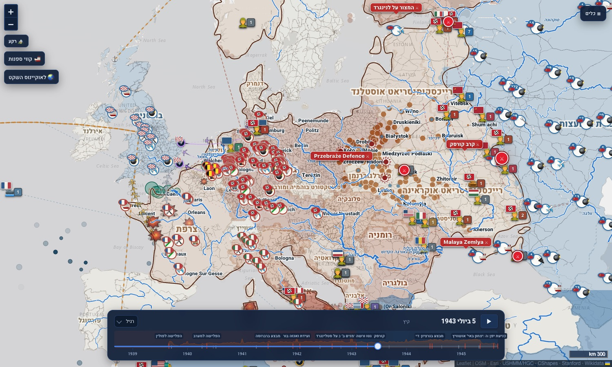
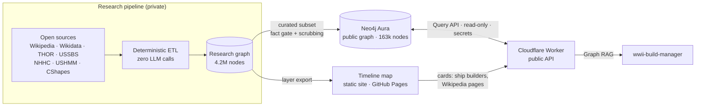

<div align="center">

# WWII Atlas · ציר הזמן של מלחמת העולם השנייה

**An interactive Hebrew timeline map of the Second World War, day by day from 1939 to 1945. It covers battles and
their units, fronts, occupation, the air war, the war at sea, industry and supply, and the persecution and
deportations. Entity cards draw on a public knowledge graph of 163k nodes through a hardened read-only API.**

[](https://github.com/pinchasrosenberg/wwii-atlas/actions/workflows/ci.yml)




**[▶ Open the atlas](https://pinchasrosenberg.github.io/wwii-atlas/)**

</div>

---

## What it is

A single map with a single clock. Press play, or drag the timeline, and everything on the map moves together.
Sites appear and disappear on their real dates. Battles, deportation trains, transports and sinkings are animated,
and the player slows down by itself in periods dense with events.

Six views focus the map: **occupation, the front, the air war, industry and supply, the persecution, and the sea.**
Layers include:

* **977 battles** in a front › campaign › battle › sub-battle hierarchy, with casualties, the units that fought and
  the supply routes active at the time;
* **front lines** as they moved, the **actual control** of territory month by month, and historical **borders**
  from CShapes;
* **formations on the move** and attack arrows, plus the units that fought at each battle;
* **the air war**: bombing raids (THOR), bombed rail junctions, flight corridors, aircraft en route and airfields;
* **the sea**: convoy routes, sinkings with a card for every ship (builder, cause, cargo, attacker), ports and
  supply landed per port;
* **industry**: plants from the US Strategic Bombing Survey and the Soviet defence-industry guide;
* **the persecution**: 1,878 camps and ghettos (USHMM/HGC), deportation trains on the real rail network, and
  741 cities with their Jewish communities;
* **terrain and seasons**: relief, daily snow cover, rivers, wetlands and peat bogs, and 1940 vegetation;
* **daily weather** from the ERA5 reanalysis (1940–1945): rain falls on the map wherever it rained that day, and
  hovering shows the day's mean temperature, rainfall and estimated snow depth at that spot.

Every **battle and unit card links to its Wikipedia page**. Battles are linked exactly through Wikidata. Units are
linked exactly when the public graph knows the unit and its country, so a Soviet "6th Army" never links to the
German one; otherwise the card opens a Wikipedia search.

## Architecture



* **The map is a static site.** Its layers are data files exported from the research pipeline, so it loads fast
  and needs no server to draw.
* **Live details come from the public graph** through the API: who built a sunken ship, a unit's exact Wikipedia
  page, search, and question answering for the [build manager](https://github.com/pinchasrosenberg/wwii-build-manager).
* **The trust boundary is the API.** The browser never holds credentials, and the database itself enforces
  read-only access. The page's Content-Security-Policy allows only that API for data.

## Repository layout

| Path | What it is |
|---|---|
| [`map/`](map/) | The timeline atlas: Leaflet, one page with 27 layer modules, data files and icons. `map/tools/check-site.mjs` verifies it on every push. |
| [`api/`](api/) | Cloudflare Worker: fixed parameterised read queries, an owner-only console, rate limits, edge caching and a daily keep-alive. |
| [`graph/`](graph/) | The public graph: what is in it, how it was chosen, and a loader with safety rails. |

## Run locally

```bash
cd map
python3 -m http.server 8000      # then open http://localhost:8000/
node tools/check-site.mjs        # scripts parse, CSP/SRI in place, no local references
```

## Security

The map has a strict Content-Security-Policy (only the API for data; no forms, plugins or base-URI changes), and
Leaflet is pinned with Subresource Integrity. Links open with `noopener`, and Wikipedia links are checked to be
`https://*.wikipedia.org` or `wikidata.org`. The API's model is in [`SECURITY.md`](SECURITY.md) and
[`api/README.md`](api/README.md).

## Sources and licensing

Wikipedia-derived facts are CC BY-SA, and Wikidata is CC0. Weather and snow come from ERA5 (Copernicus Climate Change Service / ECMWF; contains modified Copernicus information). U.S. government works (USSBS, THOR, Army CMH,
HyperWar, NHHC, JANAC) are in the public domain. CShapes 2.0 is CC BY-NC-SA 4.0. Basemaps are © OpenStreetMap,
CARTO and Esri, and relief tiles are Mapzen Terrarium on AWS. Camp and ghetto data follow the USHMM Encyclopedia
of Camps and Ghettos. Military icons are by [Icons8](https://icons8.com) (see `map/assets/military-icons/ATTRIBUTION.md`).

## Related projects

* [**wwii-build-manager**](https://github.com/pinchasrosenberg/wwii-build-manager) is the deterministic multi-agent
  orchestrator used to build this project. It reads this graph as its RAG source.
* [**roman-atlas-route**](https://github.com/pinchasrosenberg/roman-atlas-route) is a temporal atlas of the Roman
  Empire.

## License

Code: MIT © Pinchas Rosenberg. Data: see *Sources and licensing* above.
